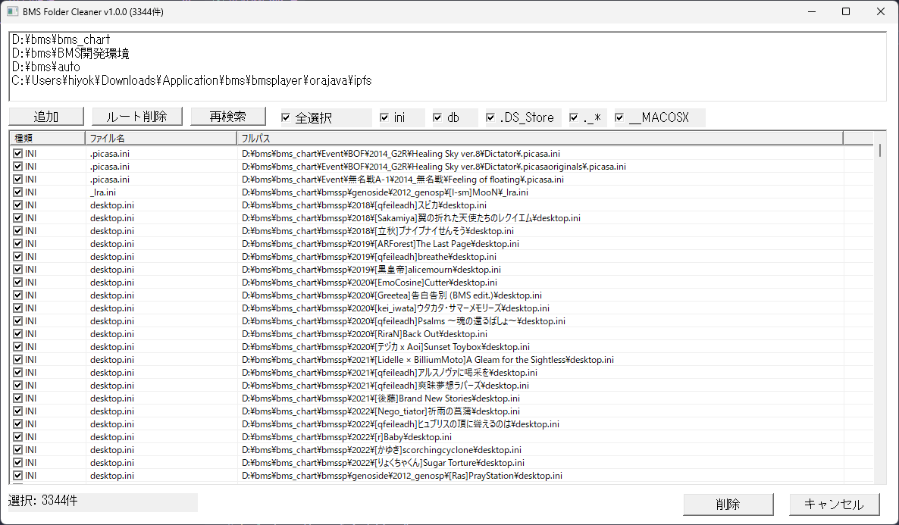

# BMS Folder Cleaner

BMSフォルダに湧いてくる

- .ini
- .db
- .DS_Store
- ._*
- __MACOSX

をまとめて駆除するためのツールです。

Everythingのインデックス検索を使うので爆速です。

---

# スクリーンショット

---

# 動作環境

- Windows 10 / 11
- Everything 1.4以降
- beatoraja (config_sys.json内のBMS Pathを使います)

---

# 使い方

## 初回起動

1. Everything をインストール
2. orajaのBMS Pathを最新にする
3. BMS Folder Cleaner(bFolderCleaner.exe)を起動

初回起動時は beatoraja の config から BMSルートを読み込みます。

---

## 検索

検索対象を選択します。

- ini
- db
- .DS_Store
- ._*
- __MACOSX

「再検索」を押すと候補一覧が表示されます。

---

## 削除

削除したいファイルにチェックを入れて「削除」を押してください。

ダブルクリックするとエクスプローラーで場所を開けます。

---

# 注意

削除したファイルは元に戻せません。

重要なデータが含まれていないことを確認してから実行してください。

---

# ライセンス

MIT License

---

# バージョン

v1.0.0

初回リリース

機能
- ini検索
- db検索
- .DS_Store検索
- ._*検索
- __MACOSX検索
- 一括削除
- Explorerで場所を開く(ダブルクリック)
- 対象件数表示
- 種類表示